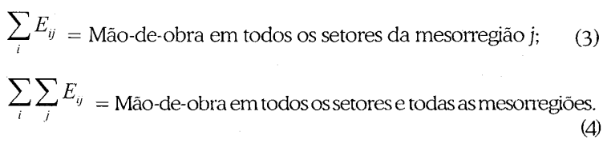

# Anotações - Economia Regional e Urbana - FEAU/USP - 2023.01

- [x] [Qual o sginificado do símbolo do NEREUS](http://www.usp.br/nereus/wp-content/uploads/Qual-o-significado-do-s%C3%ADmbolo-do-NEREUS.pdf)
- [ ] [Economia Regional - Teorias e Métodos de Análise - Capítulo 04](bibliografia/Economia%20Regional%20-%20Teorias%20e%20Métodos%20de%20Análise%20-%20Capítulo%2004.pdf)
- [ ] []

## Anotações - Leituras

### Economia Regional - Teorias e Métodos de Análise - Capítulo 04

> ***Imagens:*** de Lima, J. F., Alves, L. R., Piffer, M., & Piacenti, C. A. (2006). Análise regional das mesorregiões do estado do Paraná no final do século XX. Análise Econômica, 24(46).
> 
> 
> 

> ***Imagens:*** Mattei, T. F., & Mattei, T. S. (2017). Métodos de Análise Regional: um estudo de localização e especialização para a Região Sul do Brasil. Revista Paranaense de Desenvolvimento-RPD, 38(133), 227-243.
> 
> 

- ***Quociente Locacional***: $$QL_{ij} = \frac{\frac{E_{ij}}{\sum_j E_{ij}}}{\frac{\sum_i E_{ij}}{\sum_i \sum_j E_{ij}}} = \frac{\text{Part. da região em um setor particular (\% )}}{\text{Part. da região no total (\% )}}$$ 

  - É um indicador que resume informações sobre uma região.
  - "Se o valor do quociente for maior do que 1, isso significa que a região é relativamente mais importante naquele setor."
  - *(...) Um quociente locacional superior à unidade poderia indicar que a atividade na região é básica (voltada para a exportação) e um inferior à unidade representaria uma atividade não-básica (voltada para o mercado da própria região).*

- ***Coeficiente de Localização***: $$CL_{i} = \frac{1}{2} \sum_j | \frac{E_{ij}}{\sum_j E_{ij}} - \frac{\sum_i E_{ij}}{\sum_i \sum_j E_{ij}} | = \frac{1}{2} \sum | \text{Part. da região em um setor (\% )} - \text{Part. da região no total (\% )} |$$
  
  - É um indicador que resume informações sobre um setor.
  - O coeficiente de localização relaciona a *distribuição percentual num dado setor entre as regiões* ($\frac{E_{ij}}{E_{i.}}$) com a *distribuição percentual do emprego total entre as regiões* ($\frac{E_{.j}}{E_{..}}$)
  - Se o valor do coeficiente for igual a 0, o setor *i* estará distribuído da mesma forma que o conjunto de todos os setores. Se o seu valor for próximo de 1, ele demonstrará que o setor *i* apresenta um padrão de concentração regional mais intenso do que o conjunto de todos os setores.

- ***Coeficiente de Associação Geográfica***: $$CAG_{ik} = \frac{1}{2} \sum_j | \overbrace{\frac{E_{ij}}{\sum_i E_{ij}}}^{\text{setor i}} - \overbrace{\frac{E_{ij}}{\sum_i E_{ij}}}^{\text{setor k}} | = \frac{1}{2} \sum_j | \text{Part. da região no setor i(\% )} - \text{Part. da região no setor k (\% )} |$$
  
  - É um indicador que resume informações sobre um setor.
  - O coeficiente de associação geográfica compara as distribuições percentuais de emprego entre dois setores.
  - Se o coeficiente for próximo de 0, então o setor i estará distribuído regionalmente da mesma forma que o setor k, mostrando que os padrões locacionais dos dois setores estão associados geograficamente.

- ***Coeficiente de Redistribuição***: $$CR_i = \frac{1}{2} \sum_j | \overbrace{\frac{E_{ij}}{\sum_j E_{ij}}}^{T_1} - \overbrace{\frac{E_{ij}}{\sum_j E_{ij}}}^{T_2} | = \frac{1}{2} \sum_j | \text{Part. da região no setor em T0(\% )} - \text{Part. da região no setor em T1 (\% )} |$$
  - É um setor que resume informações de concentração espacial de setores ao longo do tempo.
  - O coeficiente de redistribuição relaciona a distribuição percentual de um mesmo setor em dois períodos de tempo.
  - Se o coeficiente for próximo de 0, não ocorreram mudanças significativas no padrão espacial de localização do setor.

- ***Curvas de Localização***:
  - As curvas permitem identificar o grau de concentração espacial das atividades econômicas.
  - Uma curva que sobre mais rapidamente indica uma atividade econômica mais concentrada.
  - A interpretação delas é como da curva de Lorenz e a leitura é a mesma que fazemos ao observar os percentis de uma distribuição.

- ***Coeficiente de Especialização***: $$ CE_j = \frac{1}{2} \sum_i | \frac{E_{ij} }{\sum_i E_{ij} } - \frac{\sum_j E_{ij} }{\sum_i \sum_j E_ij} | = \frac{1}{2} \sum_{\text{Setores da Região}} | \text{Part. do setor na região (\% )} - \text{Part. da região no total (\% )} |$$
  - É um indicador que compara a estrutura produtiva da região em destaque com a estrutura produtiva nacional.
  - Se for igual a 0, a região possui uma composição setorial idêntica à da nação.
  - A ideia é que é a distribuição esperada dos setores produtivos da região seja igual a da nação. É bem semelhante ao *Coeficiente de Contingência de Pearson*.

- ***Coeficiente de Reestruturação***: $$CR_j = \frac{1}{2} \sum_i | \overbrace{ \frac{E_{ij}}{\sum_i E_{ij}} }^{T_0} - \overbrace{\frac{E_{ij}}{\sum_i E_{ij}}}^{T_1} | = \frac{1}{2} \sum_{\text{Setores da Região}} | \text{Part. do setor na região em T0(\% )} - \text{Part. do setor na região em T1 (\% )} |$$
  - É um indicador que avalia o grau de mudança na especialização da região.
  - Quando é igual a 0, não houve modificações na composição setorial da região.

## Anotações - Aulas

### Aula 02 - 21/03/2023

> ***Primeira Lei da Geografia***: Everything is related to everything else, but near things are more related than distant things.
>
> - Waldo Tobler

- Os fenômenos socio-econômicos possuem outras determinantes que vão além da renda. Uma dessas determinantes é a posição geográfica dos indivíduos.
- `.shp`: Arquivo que dá os contornos do mapa.
- `.dbf`: Arquivo que dá informação sobre os polígonos. Como, PIB, emprego, etc.
- No mapa brasileiro de renda, há uma concentração da renda *per capita* no Centro-Sul, mas há menos desigualdade nessa mesma região (ver mapa do índice de Gini).

### Aula 03 - 23/03/2023

- Revisão de BoxPlot, Standard Deviation Plot e Quantile Plot no GeoDa
- Introdução aos Conditional Plots
- ***Variáveis Extensivas***: permitem falar sobre concentração de um indicador em uma área.
- ***Variáveis Intensiva***: permitem falar sobre desigualdade entre indicadores e entre áreas.

- ***Pesos Espaciais***: matriz de vizinhança.
- ***Defasagem Espacial***: uma vez definidos os vizinhos, você vai definir a defasagem espacial como a média de um indicador nos vizinhos.

### Aula 04 - 27/03/2023

- ***Autocorrelação Espacial Global***: teste formal de *match* entre similaridade de valor e similaridade de localização. É chamado de *I de Moran*. É simplesmente o coeficiente da regressão entre a variável estudada e sua defasagem espacial.
  - O *I de Moran* é calculado em cima da hipótese de independência espacial dos dados. O procedimento para calcular está descrito no slide da aula.

- ***LISA (Local Indicator of Spatial Autocorrelation)***: é uma classe de indicadores que apresenta a autocorrelação para cada localização. A ideia é trazer a ótica do *I de Moran* para uma vizinhança específica.

### Aula 05 - 29/03/2023

- Conditional Local Cluster Map:
- Para estudarmos essa parte temos um artigo no Moodle (Exercício 12)

- O trabalho é fazer uma análise exploratória dos dados de minas gerais e contar uma história.
- Programa para mapas bonitos: QGIS + ArchMap
- Sites para bases de dados regionais: NEREUS, IBGE Malha Digital
- Arquivos:
  - ``.shp``: imagens vetoriais do mapas
  - ``.prj``: projeçõe dos mapas
  - ``.dbf``: base de dados
  - ``.shx``: arquivo que conecta o .shp ao .dbf